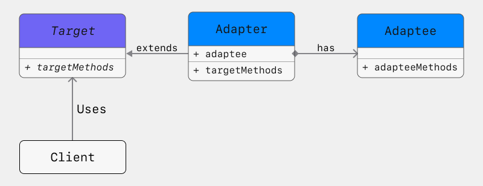

# Adapter Pattern

**Adapter Pattern** allows objects with incompatible interfaces to work together. It acts as an **adapter** between two interfaces, converting the interface of a class into another interface expected by the client.

## Structure

- **Target**: Defines the domain-specific interface that the client uses.
- **Client**: Collaborates with objects using the target interface.
- **Adaptee**: The existing class with an incompatible interface that needs adapting.
- **Adapter**: Implements the target interface and translates requests to the adaptee.

## Pros & Cons

### Pros

- **Reusability**: Allows existing classes to be used without modification.
- **Flexibility**: Clients can work with different implementations through the same interface.
- **Separation of Concerns**: Keeps client code decoupled from the adaptee’s interface.

### Cons

- **Extra layer**: Adds additional abstraction, which can increase complexity.
- **Overhead**: Slight performance cost for translation of calls.
