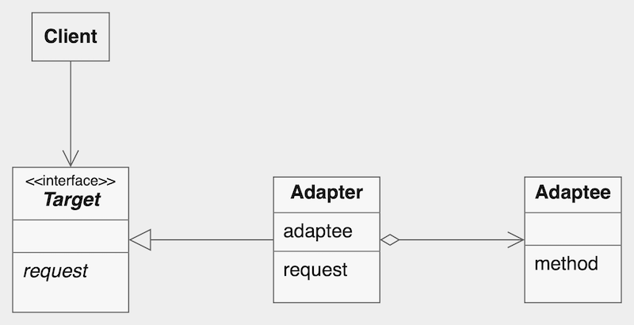
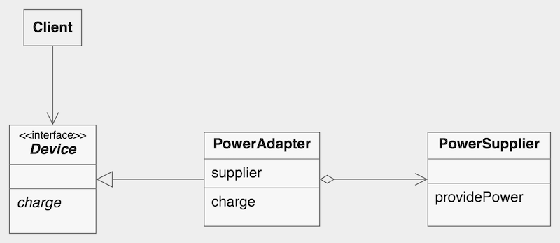

# Adapter Pattern

**Adapter Pattern** allows objects with incompatible interfaces to work together. It acts as an **adapter** between two interfaces, converting the interface of a class into another interface expected by the client.

## Structure

- **Target**: Defines the domain-specific interface that the client uses.
- **Client**: Collaborates with objects using the target interface.
- **Adaptee**: The existing class with an incompatible interface that needs to be adapted.
- **Adapter**: Implements the target interface and translates requests from the client to the adaptee.

## Considerations

- Encapsulates conversion logic, keeping client code decoupled from the adaptee.
- Supports integration of legacy or third-party code without modification.
- May increase complexity linearly with the number of adapters.

---

### Implementation

| Element         | Role    | Description                                                                  |
|-----------------|---------|------------------------------------------------------------------------------|
| `Device`        | Target  | Interface expected by the client; declares the `charge()` method.            |
| `PowerSupplier` | Adaptee | Provides incompatible 220V power via `providePower()`.                       |
| `PowerAdapter`  | Adapter | Implements `Device`; converts 220V from `PowerSupplier` into 5V for devices. |
| `Client`        | Client  | Uses the `Device` interface to charge without depending on `PowerSupplier`.  |