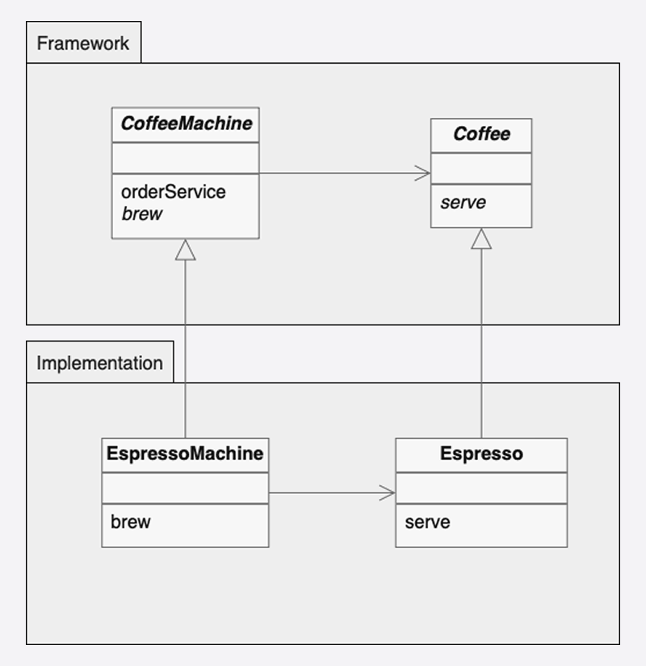

# Factory Method

**Factory Method pattern** defines an interface for creating an object but lets subclasses decide which class to
instantiate. It lets a class defer instantiation to subclasses.

## Structure

- **Creator**: Defines the factory method that returns product objects.
- **ConcreteCreator**: implements the factory method to create specific product objects.
- **Product**: Defines the interface of objects the factory method creates.
- **ConcreteProduct**: implements the Product interface and defines the concrete product objects to be created.

## Considerations

- Promotes loose coupling by eliminating the need to bind the client to concrete classes.
- Allows the client adding new products without modifying existing code.
- Can lead to more classes in the system, may increase complexity.

---

## Implementation

| Element                           | Role             | Description                                                          |
|-----------------------------------|------------------|----------------------------------------------------------------------|
| `CoffeeMachine`                   | Creator          | Defines factory method `brew()`, provides `order()`.                 |
| `Coffee`                          | Product          | Defines the interface for coffee objects.                            |
| `EspressoMachine`, `LatteMachine` | Concrete creator | Implements factory method to decide which `Coffee` object to return. |
| `Espresso`, `Latte`               | Concrete product | Implements specific types of coffee.                                 |
