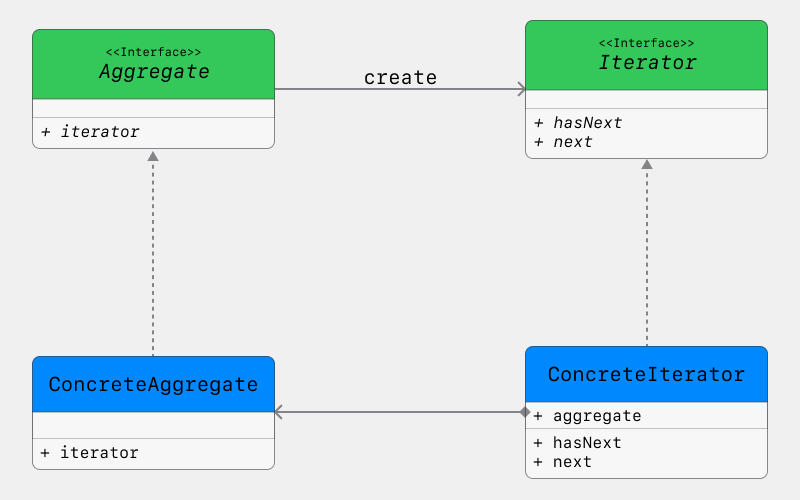
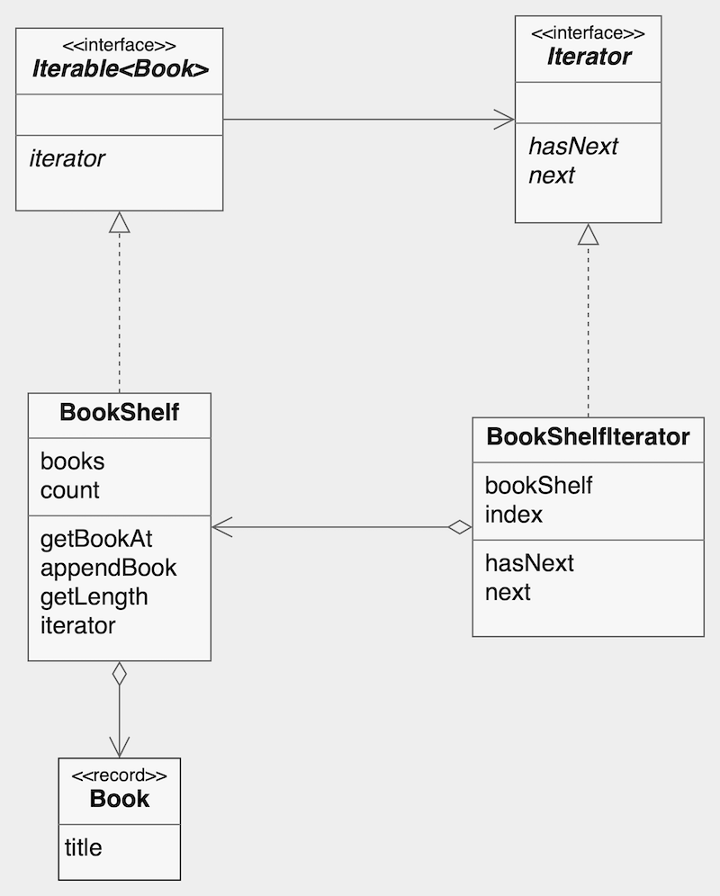

# Iterator

**Iterator Pattern** provides a way to access the elements of an aggregate object sequentially without exposing its underlying representation.

## Structure

- **Iterator**: Defines an interface for accessing and traversing elements of an aggregate object.
- **ConcreteIterator**: Implements the iterator interface and provides a way to access the elements of an aggregate object.
- **Aggregate**: Defines an interface for creating an iterator object.
- **ConcreteAggregate**: Implements the aggregate interface and provides methods for creating an iterator object.

## Considerations

- Encapsulates traversal logic separate from the aggregate’s internal structure.
- Supports multiple traversal strategies without modifying the aggregate.
- Requires additional classes (iterator + aggregate), adding complexity for simple collections.

---

## Implementation

- `Book`: Represents an element in the collection. Each Book has a `title` and accessible via `getTitle()`.
- `BookShelf`: Represents the aggregate. Stores `Book` objects and implements `Iterable<Book>`. It Provides methods `appendBook()`, `getBookAt()`, `getLength()`, and `iterator()`.
- `BookShelfIterator`: Implements `Iterator<Book>` and is responsible for traversing the `BookShelf`. It Maintains an internal `index` to track iteration state and provides methods `hasNext()` and `next()`.
- `Iterable` / `Iterator`: Define the standard interfaces for creating and traversing iterators, ensuring separation of concerns between the aggregate `BookShelf` and the traversal mechanism `BookShelfIterator`.

