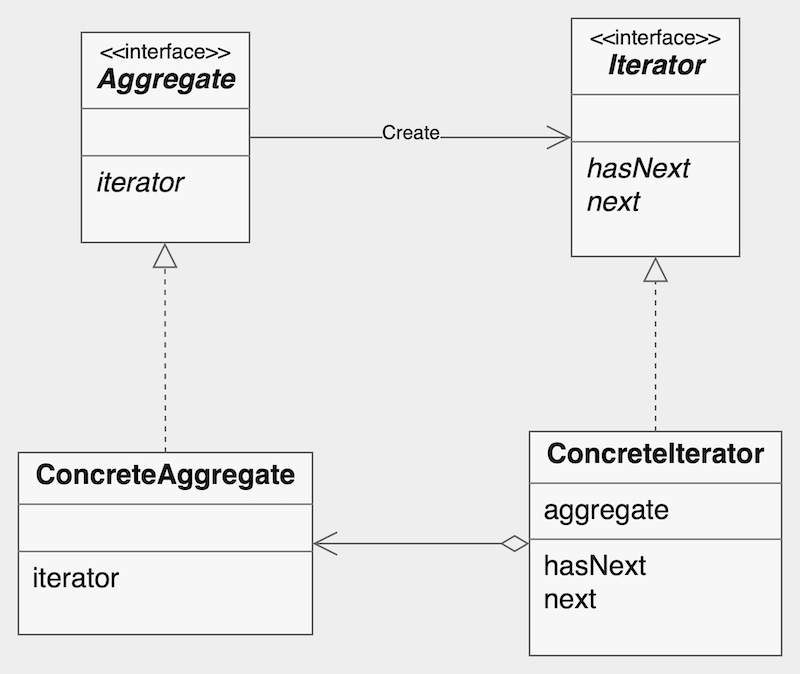

## Iterator

**Iterator Pattern** provides a way to access the elements of an aggregate object sequentially without exposing its underlying representation.

## Structure

- **Iterator**: Defines an interface for accessing and traversing elements of an aggregate object.
- **ConcreteIterator**: Implements the iterator interface and provides a way to access the elements of an aggregate object.
- **Aggregate**: Defines an interface for creating an iterator object.
- **ConcreteAggregate**: Implements the aggregate interface and provides methods for creating an iterator object.

## Pros & Cons

### Pros

- **Encapsulation**: Hides the underlying representation of the aggregate.
- **Abstraction**: Provides an interface for traversing the aggregate.
- **Polymorphism**: Can be used with different aggregates.
- **Single Responsibility**: Responsible for traversing the aggregate.
- **Open/Closed**: Extended to support new traversal algorithms without changing the aggregate.

### Cons
- **Increased complexity**: Require Extra classes and methods.

---

## Implementation

- `Book`: Represents an element in the collection. A Book has a `title` and provides access via `getTitle()`.
- `BookShelf`: Acts as the aggregate. Stores a collection of `Book` objects and implements the `Iterable<Book>` interface. Provides methods `appendBook()`, `getBookAt()`, `getLength()`, and `iterator()`.
- `BookShelfIterator`: Implements the `Iterator<Book>` interface and is responsible for traversing the `BookShelf`. Maintains an internal `index` to track iteration state and provides the methods `hasNext()` and `next()`.
- `Iterable` / `Iterator`: Define the standard interfaces for creating and traversing iterators, ensuring separation of concerns between the aggregate `BookShelf` and the traversal mechanism `BookShelfIterator`.

