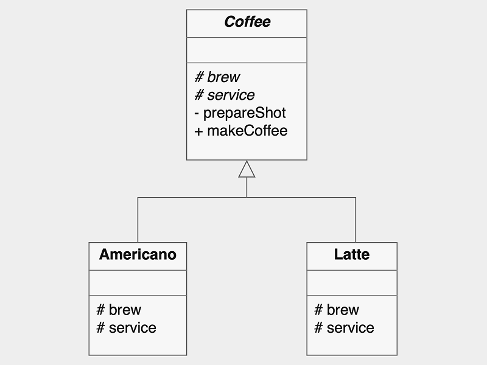

# Template Method

**Template Method Pattern** defines the skeleton of an algorithm in a method (template method), deferring some steps to subclasses.

## Structure

- **Abstract class**: Implements the template method and defines methods.
  - **Common method**: Behavior that is applied to all subclasses.
  - **Abstract method**: Defines the steps of the algorithm.
- **Concrete class**: Implements the abstract method to carry out subclass-specific behavior while keeping the algorithm structure in place.

## Considerations

- Promotes code reuse by putting invariant parts of an algorithm in a single place.
- Provides flexibility by allowing subclasses to implement varying steps of the algorithm.
- Can lead to *rigid hierarchies* if overused; require subclasses for every tiny variation.

---

### Implementation

| Element              | Role              | Description                                                               |
|----------------------|-------------------|---------------------------------------------------------------------------|
| `Coffee`             | Abstract class    | Declares `makeCoffee()` (template method) and provides shared operations. |
| `makeCoffee`         | Template method   | Defines the algorithm skeleton: prepare base, apply recipe, serve.        |
| `prepareShot`        | common method     | Common step shared by all subclasses.                                     |
| `brew`, `service`    | Abstract method   | Subclass-specific behavior.                                               |
| `Americano`, `Latte` | Concrete subclass | Implement specific recipe.                                                |